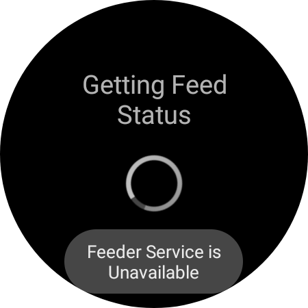

<h1>Fish Feeder WearOS App</h1>
<ul>
<li>App specifically designed for Samsung Watch 4.</li>
<li>Its used to trigger the FishFeeder API, defined in the repo <a>https://github.com/amitguptapc/Fish_Feeder_API</a></li>
</ul>
<h2>Screenshots</h2>
 
 